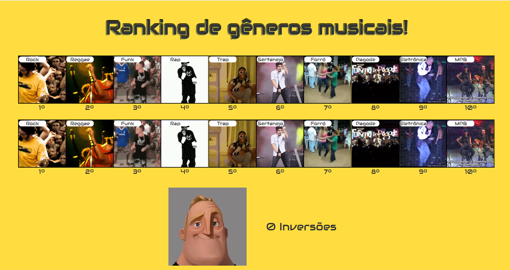
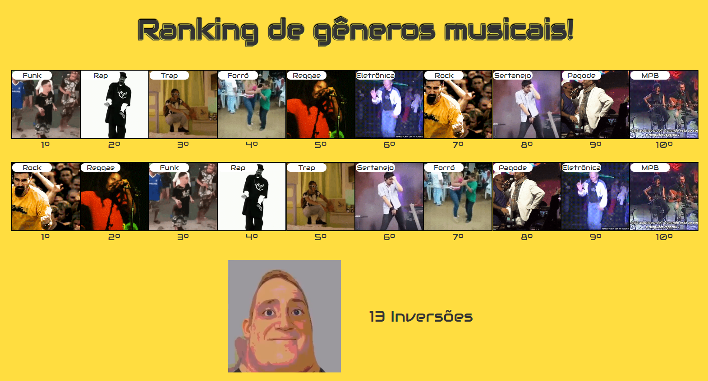
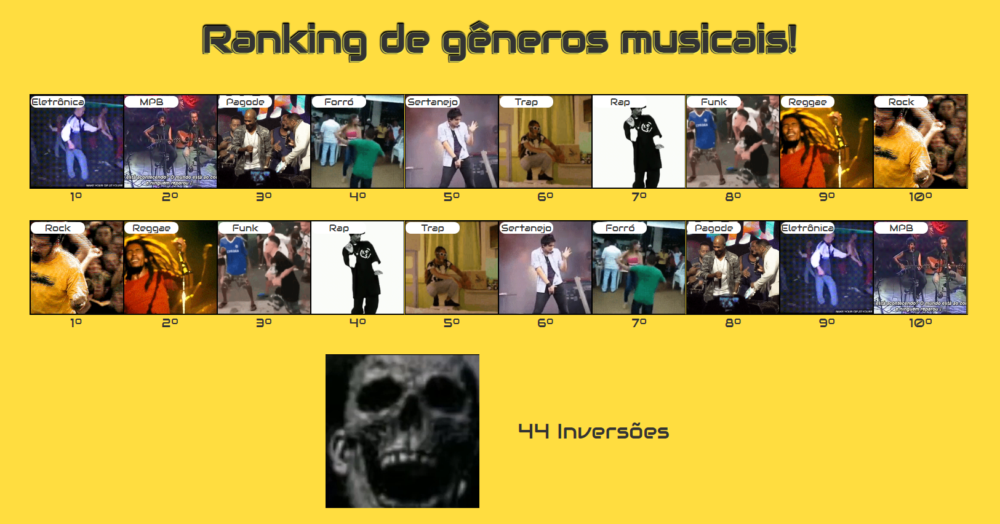

# Interval Scheduling

**Número da Lista**: 11
**Conteúdo da Disciplina**: Algoritmos Ambiciosos 

## Alunos
|Matrícula | Aluno |
| -- | -- |
| 20/0026488  |  Rafael de Medeiros Nobre |

## Sobre 
O projeto a seguir é um ranking interativo de gêneros musicais, que utiliza o algoritmo de contagem de inversões para identificar o grau de similaridade entre o gosto musical de dois usuários.

## Screenshots







## Apresentação

A apresentação pode ser encontrada no arquivo assets/apresentacao.mp4

## Instalação 
**Linguagem**: Javascript
**Framework**: React.js<br>

Para executar o projeto, é necessário ter o Node.js a partir da versão 16.0 instalado na máquina. clone o repositório e execute os passos:

**Passo 1**
```
cd inversion_count
```

**Passo 2**
```
npm install
```

## Uso 

O projeto pode ser acessado pelo [LINK](https://projeto-de-algoritmos.github.io/DC_RankingMusical/), ou pode ser executado localmente seguindo o passo a passo abaixo:

Para executar o projeto, execute o código:

```
npm start
```

E abra o endereço http://localhost:3000

Na interface interativa, os gêneros são arrastáveis, e devem ser colocados na ordem de preferência dos usuário, enquanto é calculado o nível de compatibilidade entre os dois gostos.